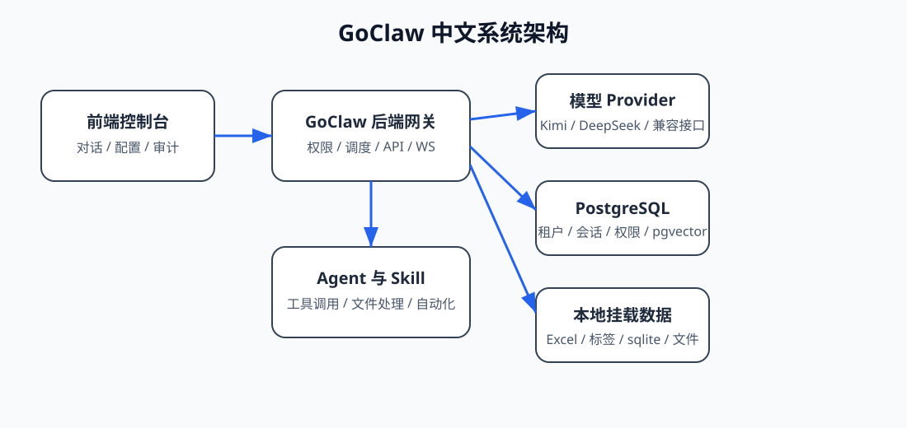
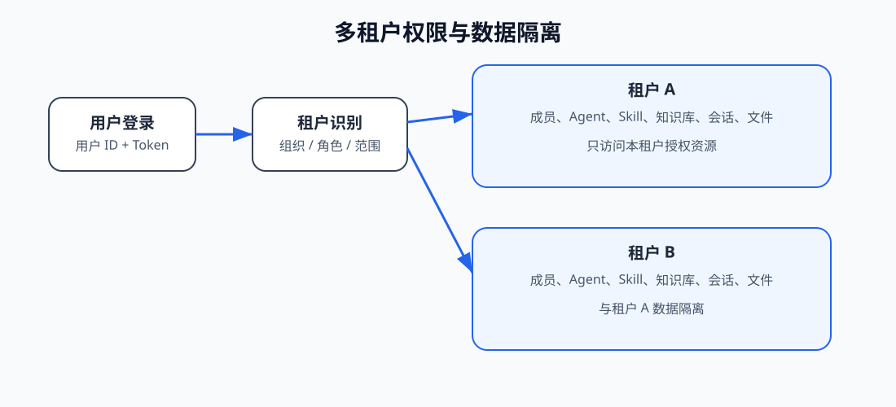
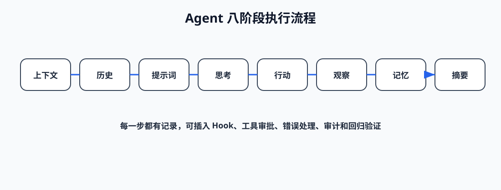
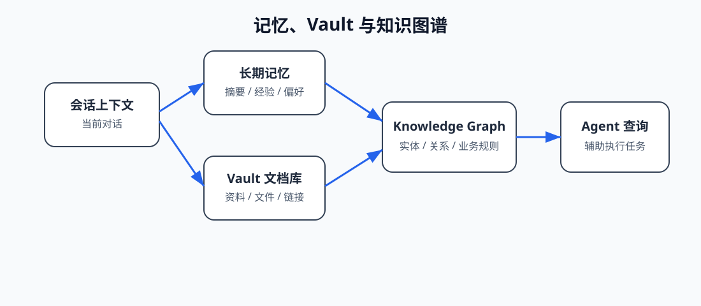
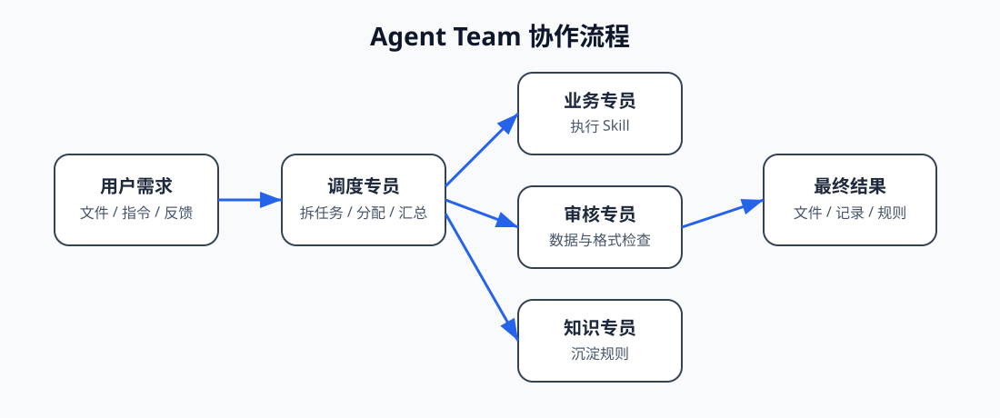
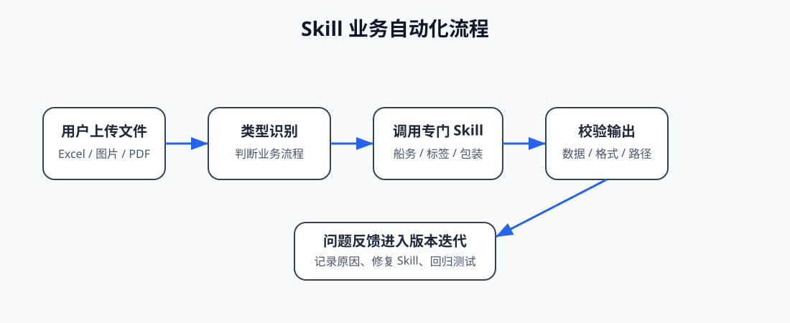
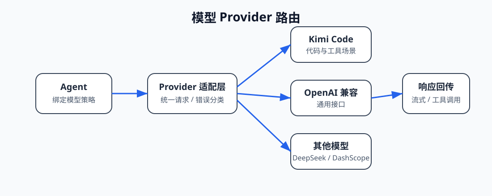
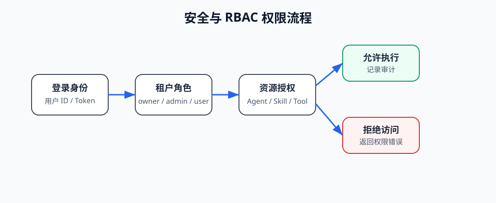

<p align="center">
  
</p>

<p align="center"><strong>GoClaw Clear 专用 - by:Annmy</strong></p>

<p align="center">
多租户 AI Agent 平台。支持 Agent、Agent Team、Skill、工具、知识库、定时任务、Hook、审计、权限控制和本地业务自动化。
</p>

<p align="center">
  <a href="https://github.com/Annmys/goclaw">项目地址</a> ·
  <a href="#快速开始">快速开始</a> ·
  <a href="#核心能力">核心能力</a> ·
  <a href="#系统架构">系统架构</a>
</p>

<p align="center">
  <a href="https://go.dev/"></a>
  <a href="https://www.postgresql.org/"></a>
  <a href="https://www.docker.com/"></a>
  
</p>

## 项目定位

GoClaw 是一个面向企业内部和本地业务自动化的多租户 AI Agent 平台。它不是单纯聊天界面，而是把模型、Agent、技能、工具、知识库、文件处理、定时任务和权限体系组合在一起，让不同用户、不同租户、不同业务流程可以在同一套系统中稳定执行。

当前项目仓库地址：

```text
https://github.com/Annmys/goclaw
```

## 核心能力

- **多租户管理**：支持租户、用户、角色、租户内资源隔离和租户级 Agent 可见范围。
- **Agent 与 Agent Team**：支持单 Agent 对话，也支持多 Agent 协同、任务拆分、审核和返工。
- **Skill 技能系统**：支持核心 Skill、自定义 Skill、版本管理、权限控制和业务流程固化。
- **知识库与图谱**：支持文档存储、Vault、Knowledge Graph、语义检索和业务资料沉淀。
- **定时任务**：支持按计划同步本地业务数据，例如流转单、产品包装重量表、包装资料索引。
- **本地文件处理**：支持 Excel、Word、PDF、图片、标签、船务清单等本地文件处理场景。
- **模型 Provider**：支持 OpenAI 兼容接口、Kimi Code、DeepSeek、DashScope 等多种模型接入方式。
- **权限与安全**：支持 Gateway Token、API Key、租户角色、管理员权限、工具审批、审计记录和敏感配置隔离。
- **Docker 部署**：支持后端、前端、PostgreSQL、pgvector 和可选组件组合部署。

## 系统架构

<p align="center">
  
</p>

GoClaw 的核心由前端控制台、后端网关、PostgreSQL 数据库、Agent 运行循环、Skill 执行系统、本地挂载目录和外部模型 Provider 组成。前端负责配置和交互，后端负责权限、调度、对话、工具执行和数据存储。

## 多租户架构

<p align="center">
  
</p>

租户可以理解为组织。租户内用户共享该租户允许访问的 Agent、Agent Team、Skill、工具、知识库和定时任务结果。不同租户之间的数据、会话和权限互相隔离。

## Agent 执行流程

<p align="center">
  
</p>

Agent 的执行不是一次简单模型调用，而是由上下文加载、历史整理、Prompt 生成、模型思考、工具调用、结果观察、记忆写入和摘要沉淀组成。这样可以让复杂任务有过程、有记录、有回滚依据。

## 记忆与知识库

<p align="center">
  
</p>

GoClaw 的知识能力由短期会话、长期记忆、Vault 文档库和 Knowledge Graph 组成。业务数据可以通过定时任务转换为可查询索引，也可以通过 Vault 进入知识库。

## Agent Team 协作流程

<p align="center">
  
</p>

Agent Team 适合复杂业务。调度 Agent 负责拆分任务，业务 Agent 负责执行，审核 Agent 负责检查数据准确性和文件格式，知识 Agent 负责沉淀规则和反馈问题。

## Skill 与业务自动化

<p align="center">
  
</p>

Skill 用来把稳定的业务流程固化为可复用能力。例如船务清单处理、标签生成、包装计算、流转单查询、产品包装重量查询等，都可以通过 Skill 统一执行和迭代。

## 模型与 Provider

<p align="center">
  
</p>

GoClaw 可以接入多个模型 Provider，并通过不同 Agent 绑定不同模型。企业可以按业务场景选择模型，例如普通问答、代码能力、文件处理、审核、翻译、图片分析等。

## 安全与权限

<p align="center">
  
</p>

GoClaw 的权限控制重点包括：登录身份、Gateway Token、租户角色、管理员权限、Agent 可见范围、工具审批、API Key 加密存储、审计记录和租户数据隔离。

## 快速开始

### 使用 Docker Compose

```bash
git clone https://github.com/Annmys/goclaw.git
cd goclaw

chmod +x prepare-env.sh
./prepare-env.sh

make up WITH_WEB_NGINX=1
```

默认访问地址：

```text
前端控制台：http://localhost:3000
后端健康检查：http://localhost:18790/health
```

### 常用命令

```bash
make up                 # 启动服务
make down               # 停止服务
make logs               # 查看后端日志
make reset              # 清理数据并重建，谨慎使用
```

### Windows 本地常见部署形态

```text
D:\goclaw                 # 项目源码
D:\数据\存储              # 用户可见文件输出目录
D:\数据\包装流转单        # 流转单索引与查询数据
D:\数据\产品包装重量表    # 产品包装重量表与 sqlite 索引
D:\数据\标签模板          # BarTender 标签模板
D:\goclaw操作记录         # 操作记录、Skill 备份、修改计划
```

## 本项目重点业务能力

### 船务清单处理

- 识别 CI、PL、EPL 等 Excel 文件类型。
- 查询流转单内容索引。
- 查询产品包装重量表。
- 生成或补全 EPL/PL。
- 保留 Excel 格式、合并单元格、列宽、边框、Logo 和关键公式。

### 标签生成

- 读取订单 Excel 和订单附件。
- 识别标签类型：工字标、唛头、平面标等。
- 根据客户要求和特殊型号选择模板。
- 调用 BarTender 生成真实标签预览。
- 支持用户确认后再批量打印。

### 包装计算

- 参考原有 C# 包装计算逻辑。
- 读取包装资料索引。
- 输出计算结果到订单对应文件夹。
- 后续可继续兼容旧包装资料。

### 定时数据同步

- 同步流转单。
- 转换产品包装重量表。
- 转换包装资料。
- 生成 sqlite 索引，方便 Skill 快速查询。

## 目录说明

| 路径 | 说明 |
| --- | --- |
| `cmd/` | 命令行入口和辅助工具 |
| `internal/` | Go 后端核心代码 |
| `ui/web/` | React 前端控制台 |
| `skills/` | 内置 Skill |
| `migrations/` | 数据库迁移 |
| `docs/` | 项目文档 |
| `docker/` | Docker 运行依赖 |
| `_statics/` | README 图片和静态资源 |

## 本地开发

### 后端

```bash
go test ./...
go build -o goclaw.exe .
```

### 前端

```bash
corepack pnpm -C ui/web install
corepack pnpm -C ui/web build
```

### Docker 前端上线

```bash
docker compose -f docker-compose.yml -f docker-compose.postgres.yml -f docker-compose.selfservice.yml up -d --build goclaw-ui
```

## 版本管理规则

- 本地项目路径为 `D:\goclaw`。
- 每次修改完成后必须先在本地 git 提交。
- 本地提交后必须同步到 `https://github.com/Annmys/goclaw`。
- 不推送到其他上游仓库。
- 推送时避免新增无关 Contributors。
- 重要修改必须写入 `D:\goclaw操作记录\项目续接记录.md`。

## 许可证

本项目使用 [CC BY-NC 4.0](LICENSE) 许可证。

## Star History

<a href="https://www.star-history.com/?repos=Annmys%2Fgoclaw&type=date&legend=top-left">
 <picture>
   <source media="(prefers-color-scheme: dark)" srcset="https://api.star-history.com/image?repos=Annmys/goclaw&type=date&theme=dark&legend=top-left" />
   <source media="(prefers-color-scheme: light)" srcset="https://api.star-history.com/image?repos=Annmys/goclaw&type=date&legend=top-left" />
   
 </picture>
</a>
